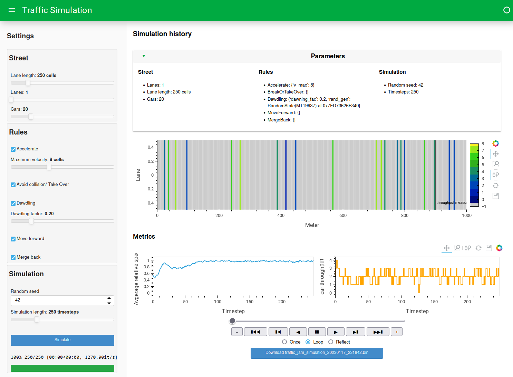

# Traffic Jam Simulation

## Running the simulation

After activating the virtual envrionment run

```python
python main.py
```

and a browser window should open at [localhost:8001](http://localhost:8001) that looks like this:



### User Interface

The user interface you see above is divided into two sections:

* The left section contains the simulation parameters and controls
* The center section contains the simulation visualization and metrics

As a start, click the blue "Simulate" button on the bottom left. The simulation will be calculated for all time steps and you will shortly see the stree visualization and metrics update. Replay the simulation, by clicking the "▶" button below the visualization.
## Installation

### Requirements

* Python 3.8 or higher
* Python virtual environment

### Setup (bash on Linux)

1. Clone the repository

    ```bash
    git clone https://github.com/pvonderlind/ModSim_Exercise_Group04.git
    ```

2. Create a virtual environment

    ```bash
    python3 -m venv venv
    ```
3. Activate the virtual environment

    ```bash
    source venv/bin/activate
    ```
4. Install the requirements

    ```bash
    pip install -r requirements.txt
    ```

## Documentation

A report draft is available at: https://www.overleaf.com/7462244329cmmnqhkhbrbr
